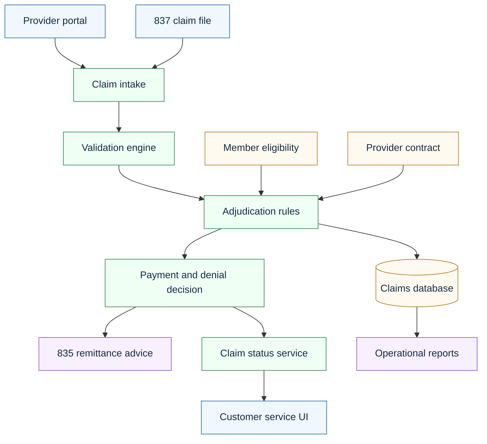
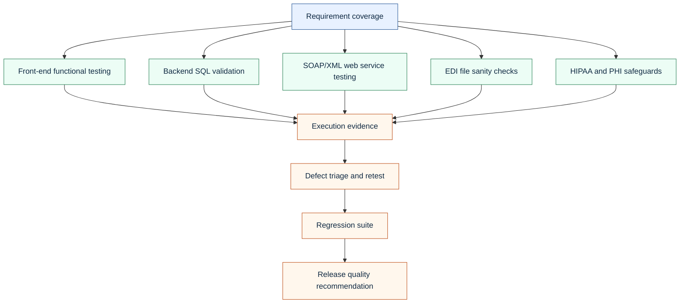

# Healthcare Claims Manual QA Portfolio

**Target role:** QA Manual Tester - Healthcare Claims  
**Built for:** Healthcare claims SQA work involving requirements analysis, manual functional testing, SQL backend validation, regression, integration, SOAP/XML, EDI awareness, Jira defect handling, and HIPAA-sensitive test discipline.

This repository is a hiring-ready portfolio project and a practical walkthrough for healthcare claims manual QA work. It uses a synthetic healthcare claims system so every artifact is safe to share publicly while still showing realistic QA judgment.

## What This Project Proves

- Business requirements can be translated into test strategy, test plans, traceability, test cases, and execution evidence.
- Healthcare claims workflows can be tested across front-end screens, backend database records, SOAP/XML service behavior, EDI-style files, and regression risk.
- SQL validation can uncover claim status mismatches, duplicate payments, invalid member/provider relationships, orphan records, and adjudication defects.
- Jira-ready defects can be documented with clear reproduction steps, expected results, actual results, impact, evidence, severity, priority, and retest criteria.
- PHI, HIPAA, synthetic data, audit trails, access controls, and high-risk healthcare data roles require disciplined test handling.

## How The Work Fits The Job

| Role requirement | Portfolio proof |
|---|---|
| Analyze business requirements and technical specifications | [Job Walkthrough](docs/00-job-walkthrough.md), [QA Strategy](docs/02-qa-strategy.md), [Traceability Matrix](docs/04-requirements-traceability-matrix.md) |
| Create test strategy, test plans, and test cases | [Test Plan](docs/03-test-plan.md), [Test Case Design](docs/05-test-case-design.md), [Claims Test Cases CSV](artifacts/test-cases/claims-test-cases.csv) |
| Execute SQA testing aligned with standards | [Execution Walkthrough](docs/00-job-walkthrough.md), [Regression and Integration Plan](docs/10-regression-integration-load-testing.md) |
| Perform backend database testing with complex SQL | [SQL Backend Testing Guide](docs/06-sql-backend-testing.md), [Validation SQL](artifacts/sql/claims_backend_validation.sql) |
| Perform front-end functional testing of Web and GUI apps | [Test Case Design](docs/05-test-case-design.md), [Test Cases](artifacts/test-cases/claims-test-cases.csv) |
| Test web services using XML and SOAP/UI | [EDI and SOAP Testing Guide](docs/07-edi-and-soap-testing.md), [SOAP Request](artifacts/soap/claim-status-request.xml) |
| Log and retest defects in Jira | [Jira Defect Workflow](docs/08-jira-defect-workflow.md), [Sample Jira Defects](artifacts/defects/jira-defect-samples.md) |
| Ensure HIPAA compliance and PHI discipline | [HIPAA Test Data Strategy](docs/09-hipaa-phi-data-strategy.md), [Synthetic Data](artifacts/data/synthetic_claims.csv) |
| Knowledge of claims, EDI, medical terminology, and load testing | [EDI Samples](artifacts/edi/837P-synthetic-claim.edi), [Regression and Load Plan](docs/10-regression-integration-load-testing.md) |

## End-To-End QA Workflow

```mermaid
flowchart LR
    A["Business requirement"] --> B["Technical specification review"]
    B --> C["Risk-based test strategy"]
    C --> D["Traceability matrix"]
    D --> E["Manual front-end test cases"]
    D --> F["SQL backend validation checks"]
    D --> G["SOAP/XML and EDI checks"]
    E --> H["Test execution evidence"]
    F --> H
    G --> H
    H --> I{"Defect found?"}
    I -- "Yes" --> J["Jira defect with evidence"]
    J --> K["Partner with project team"]
    K --> L["Retest fixed behavior"]
    L --> M["Regression pack"]
    I -- "No" --> M
    M --> N["Release recommendation"]

    classDef planning fill:#E8F1FF,stroke:#2D5B9A,stroke-width:1px,color:#102A43;
    classDef execution fill:#E9F8EF,stroke:#2F855A,stroke-width:1px,color:#102A43;
    classDef defect fill:#FFF4E5,stroke:#B7791F,stroke-width:1px,color:#102A43;
    class A,B,C,D planning;
    class E,F,G,H,L,M,N execution;
    class I,J,K defect;
```

## System Under Test

## Walkthrough: How To Do The Job

1. Start with [the job walkthrough](docs/00-job-walkthrough.md) to see the full operating model for a healthcare claims QA tester.
2. Review [the role alignment and keyword map](docs/01-role-alignment-and-ats-keywords.md) to see how the resume and project match the job posting.
3. Read [the QA strategy](docs/02-qa-strategy.md) to understand scope, risk, assumptions, entry criteria, exit criteria, and coverage.
4. Use [the test plan](docs/03-test-plan.md) and [the traceability matrix](docs/04-requirements-traceability-matrix.md) to connect requirements to test evidence.
5. Execute [the test cases](artifacts/test-cases/claims-test-cases.csv) with the logic explained in [test case design](docs/05-test-case-design.md).
6. Run the backend checks in [SQL backend testing](docs/06-sql-backend-testing.md) using [the SQL script](artifacts/sql/claims_backend_validation.sql).
7. Review [EDI and SOAP testing](docs/07-edi-and-soap-testing.md) with the sample 837, 835, and SOAP XML artifacts.
8. Log defects using [the Jira workflow](docs/08-jira-defect-workflow.md) and [sample defect writeups](artifacts/defects/jira-defect-samples.md).
9. Keep testing safe with [the HIPAA and PHI test data strategy](docs/09-hipaa-phi-data-strategy.md).
10. Close with [the regression, integration, and load testing plan](docs/10-regression-integration-load-testing.md) and [the interview walkthrough script](docs/11-interview-walkthrough-script.md).
11. Review [the test execution summary](docs/13-test-execution-summary.md), [data dictionary](docs/14-data-dictionary.md), and [quality gates](docs/15-quality-gates.md).

## Claims QA Coverage Model

## Resume Files

- [ATS Word resume](resume/Justin_Arndt_QA_Manual_Tester_Healthcare_Claims_ATS.docx)
- [ATS Markdown resume](resume/Justin_Arndt_QA_Manual_Tester_Healthcare_Claims_ATS.md)
- [ATS plain text resume](resume/Justin_Arndt_QA_Manual_Tester_Healthcare_Claims_ATS.txt)

The resume is tailored from the strongest healthtech/compliance and master resume versions already in the portfolio. The wording prioritizes healthcare QA, manual testing, SQL, regulated systems, HIPAA-aware workflows, defect handling, traceability, and claims-domain proof.

## GitHub Publishing

Use [the GitHub publishing guide](docs/12-github-publishing-guide.md) for the recommended repository name, description, topics, profile pin text, and local commands.

## Professional Quality Signals

- GitHub Actions smoke check validates required files, CSV row counts, SOAP XML parsing, Markdown links, balanced code fences, and Mermaid coverage.
- Security policy defines the public data boundary and reinforces synthetic-data-only handling.
- Contribution guide documents review expectations as if this were maintained by a QA team.
- Test execution summary turns the artifact set into a release-style communication package.
- Data dictionary makes the synthetic claims model easy to inspect without needing a live database.

## Portfolio Positioning

This project is intentionally built as a proof artifact, not a fictional production claim system. It shows a practical work pattern for healthcare claims QA:

- read the requirements carefully;
- test the application like a user;
- test the data like a backend analyst;
- test the service contracts like an integration partner;
- protect PHI like the role is high risk;
- communicate defects so developers, QA, business analysts, and stakeholders can act.

## Safety Note

All member names, claim IDs, provider IDs, service dates, diagnosis/procedure examples, and file contents are synthetic. The project contains no PHI, no real payer data, and no employer-confidential information.
