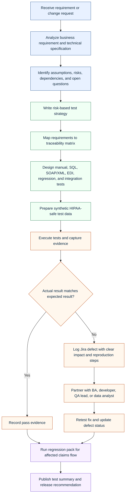
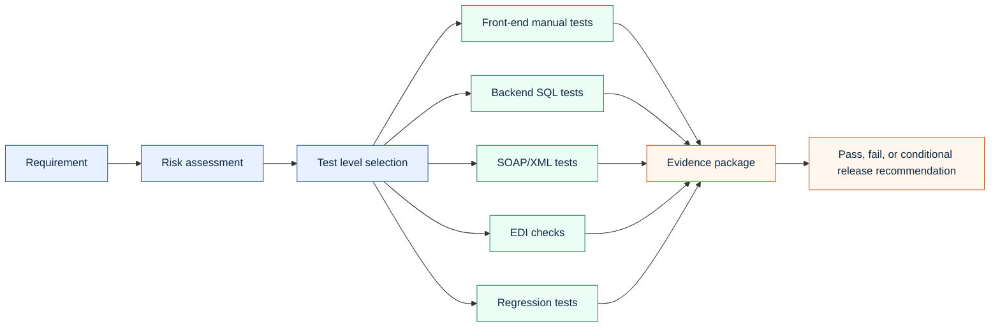
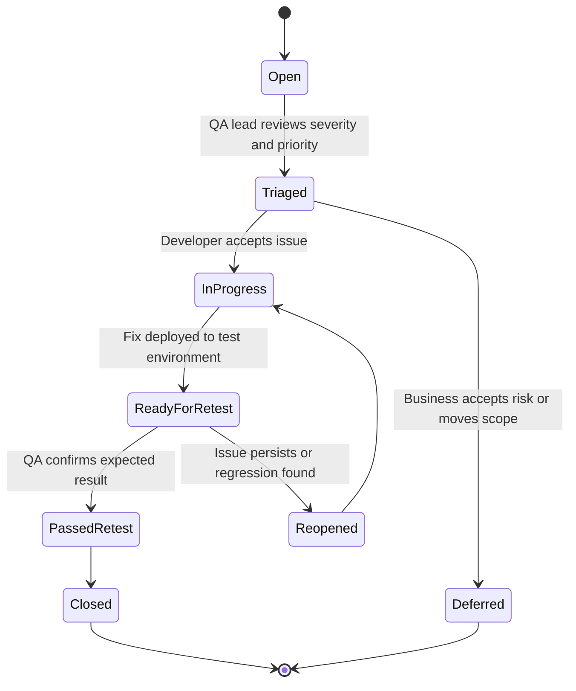

# Healthcare Claims QA Manual Tester Walkthrough

This walkthrough shows how a QA Manual Tester can approach a healthcare claims application. The emphasis is practical: how to move from requirements to test evidence, how to test front-end and backend behavior together, how to communicate defects, and how to protect PHI while testing a high-risk healthcare workflow.

## Operating Model

## Step 1: Analyze Requirements

The first job is not to start clicking through the application. It is to understand what the change is supposed to do, what systems it touches, and what would create business or compliance risk if it fails.

For a claims system, review should include:

- claim intake rules;
- member eligibility logic;
- provider contract rules;
- diagnosis and procedure code handling;
- claim status transitions;
- payment, denial, and adjustment logic;
- EDI inbound and outbound expectations;
- web service request and response rules;
- audit trail, access, and PHI handling requirements;
- reporting or downstream data dependencies.

The output is a short list of risks and testable requirements. If a requirement cannot be tested, I would clarify it before building the test cases.

## Step 2: Build The Test Strategy

The test strategy explains what will be tested, why it matters, and how success will be proven. For this role, the strategy needs to cover front-end behavior, database validation, integration behavior, regression risk, and compliance discipline.

## Step 3: Create Traceability

Traceability prevents gaps. Each business requirement should have one or more test cases. Each test case should have expected results, evidence, and a final status.

Good traceability answers four questions:

- What requirement are we testing?
- Which test case proves it?
- What evidence shows the result?
- What defect exists if it failed?

The project includes a traceability matrix in [CSV form](../artifacts/traceability/requirements-traceability-matrix.csv) and a readable explanation in [requirements traceability](04-requirements-traceability-matrix.md).

## Step 4: Prepare HIPAA-Safe Test Data

Testing must use synthetic data unless a controlled environment and authorization explicitly allow otherwise. Even then, minimum necessary access applies.

For claims testing, synthetic data needs to include enough variety to test rules:

- active and inactive members;
- in-network and out-of-network providers;
- covered and non-covered procedures;
- diagnosis/procedure combinations;
- timely filing limits;
- duplicate claim scenarios;
- paid, denied, suspended, and adjusted claim statuses.

The synthetic data in this project is stored in [artifacts/data](../artifacts/data).

## Step 5: Execute Front-End Functional Tests

Front-end manual testing verifies what a user can see and do:

- claim search;
- claim detail display;
- claim status;
- denial reason visibility;
- member and provider display;
- permissions and masking;
- error handling;
- screen-level validation;
- workflow transitions.

The tester should capture evidence without exposing sensitive data. In a real Jira ticket, screenshots should be redacted or taken in a synthetic environment.

## Step 6: Execute Backend SQL Validation

Backend testing proves that the database agrees with what the front end and services report. SQL checks should validate both individual rows and cross-table relationships.

Examples:

- claim header status matches line status;
- paid amount does not exceed allowed amount;
- denied claims have denial reason codes;
- remittance records exist for paid claims;
- duplicate claim candidates are flagged;
- member eligibility exists for the service date;
- provider contract is active for the service date;
- no orphan claim line records exist.

The SQL examples are in [claims_backend_validation.sql](../artifacts/sql/claims_backend_validation.sql).

## Step 7: Execute SOAP/XML And EDI Checks

Healthcare claims systems often interact through structured files and services. A manual QA tester may not own the integration platform, but should understand the data contract well enough to test it.

This portfolio includes:

- a synthetic 837 professional claim file;
- a synthetic 835 remittance advice file;
- a SOAP claim status request;
- a SOAP claim status response;
- a guide for using SOAP UI concepts to validate request and response behavior.

## Step 8: Log Defects In Jira

A strong defect is not just "it broke." It explains the business impact and gives the team enough evidence to reproduce and fix it.

Sample defect writeups are in [jira-defect-samples.md](../artifacts/defects/jira-defect-samples.md).

## Step 9: Retest And Run Regression

Retesting proves the specific fix works. Regression proves the fix did not break neighboring behavior.

For claims, regression should focus on:

- claim creation and intake;
- status transitions;
- adjudication outcomes;
- payment and denial logic;
- claim search and detail screens;
- EDI output;
- web service response consistency;
- database state.

## Step 10: Communicate The Release Recommendation

The final output should be concise and decision-ready:

- scope tested;
- tests executed;
- pass/fail count;
- defects opened, fixed, retested, deferred, or still open;
- known risks;
- evidence location;
- recommendation.

A good QA tester does not just report activity. They make quality risk visible enough for the team to make a responsible decision.
