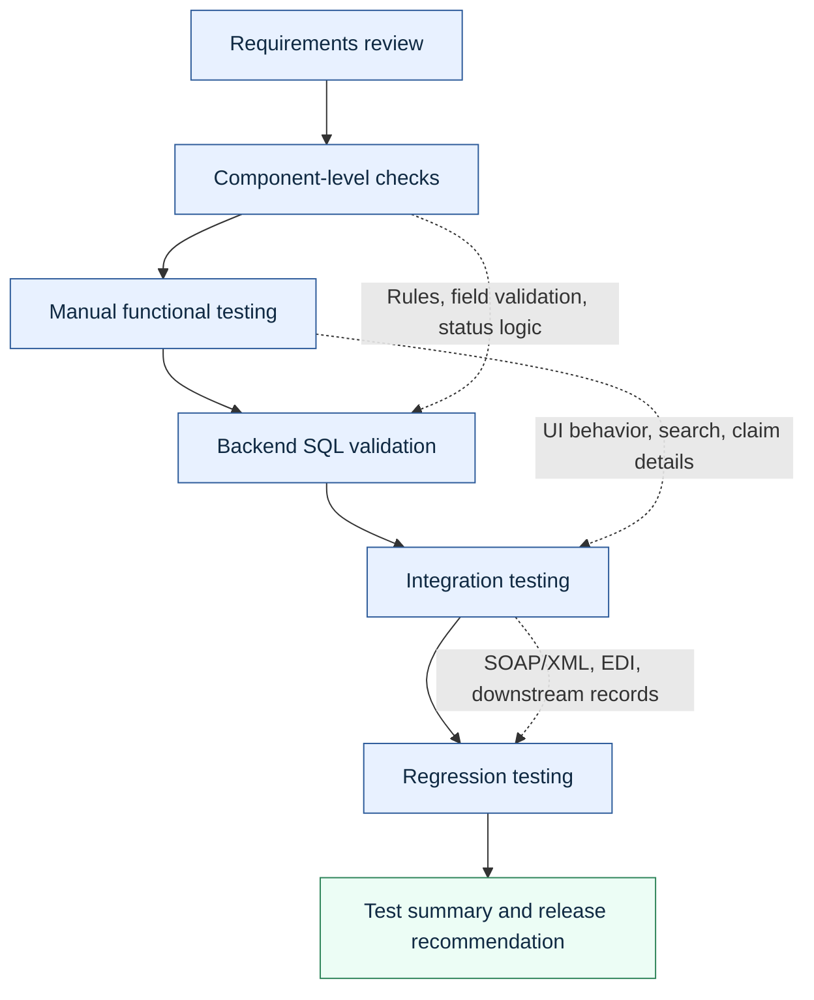

# QA Strategy For Healthcare Claims

## Purpose

This strategy defines how to test a healthcare claims application that receives claims, validates member and provider data, adjudicates claim lines, stores claim outcomes, returns claim status through a service, and produces remittance output.

The strategy is built for a manual QA tester who must combine functional testing, backend database validation, integration awareness, regression testing, defect management, and HIPAA-safe handling of sensitive data.

## Scope

In scope:

- claim intake from front-end entry and EDI-style files;
- member eligibility validation;
- provider contract validation;
- claim adjudication outcomes;
- claim line status and claim header status;
- denial reason and adjustment reason behavior;
- claim status search and detail screens;
- SOAP/XML claim status inquiry;
- 835-style remittance output checks;
- backend SQL validation;
- regression testing for high-risk claim paths;
- Jira-style defect reporting and retesting.

Out of scope for this portfolio:

- real payer rules;
- real PHI;
- production system access;
- actual Oracle or SQL Server connection execution;
- formal load test execution against a real environment.

## Test Levels

## Risk-Based Priorities

| Risk | Why it matters | Test response |
|---|---|---|
| Incorrect payment amount | Financial and compliance impact | SQL paid amount checks, front-end display checks, remittance output checks |
| Incorrect denial | Member/provider impact and rework | Denial reason tests, negative scenarios, line-level validation |
| PHI exposure | HIPAA and trust risk | Masking checks, synthetic data, access control validation |
| Status mismatch | Operational confusion and bad service responses | UI, database, and SOAP response comparison |
| Duplicate payment | Financial leakage | Duplicate claim SQL checks and regression cases |
| Broken integration | Downstream failures | EDI/SOAP checks and integration traceability |
| Incomplete audit evidence | High-risk role accountability | Evidence naming, traceability, and defect attachments |

## Entry Criteria

- Business requirements are reviewed and testable.
- Technical specifications are available or gaps are documented.
- Test environment is available.
- Synthetic data is loaded or ready to create.
- Access permissions are appropriate for the tester.
- Known environment issues are documented.
- Requirements traceability matrix has initial coverage.

## Exit Criteria

- Critical and high-priority test cases are executed.
- Backend SQL validation checks are complete for in-scope scenarios.
- SOAP/XML and EDI checks are complete for integration scenarios.
- Critical and high defects are fixed, retested, or formally deferred.
- Regression testing is complete for impacted workflows.
- Test summary includes remaining risk and release recommendation.

## Evidence Standard

Each executed test should include:

- test case ID;
- requirement ID;
- environment;
- test data ID;
- expected result;
- actual result;
- pass/fail status;
- evidence link or attachment reference;
- defect ID if failed;
- retest evidence if applicable.

