# Test Plan: Synthetic Claims Adjudication Release

## Release Scenario

The synthetic claims platform is adding improved claim status display and backend adjudication checks. The release must confirm that claims move through intake, validation, adjudication, payment/denial, status inquiry, and remittance output correctly.

## Objectives

- Verify claim intake accepts valid professional claims and rejects invalid submissions.
- Verify member eligibility is evaluated against service date.
- Verify provider contract status affects payment or denial behavior.
- Verify claim header and claim line statuses remain consistent.
- Verify claim search and detail screens display accurate status, amounts, and denial reasons.
- Verify SOAP claim status inquiry returns the same status stored in the database.
- Verify paid claims have remittance records.
- Verify denied claims have denial or adjustment reason codes.
- Verify regression coverage protects existing paid, denied, suspended, and adjusted workflows.

## Environments

| Environment | Purpose | Notes |
|---|---|---|
| QA | Primary execution | Synthetic data only |
| Integration | SOAP/XML and EDI checks | Used after QA pass |
| Performance-like | Load test planning | Not executed in this portfolio |

## Test Data

The test data set contains synthetic members, providers, claims, and claim lines.

| Data type | Examples |
|---|---|
| Member | Active member, inactive member, future-effective member |
| Provider | In-network provider, terminated provider, out-of-network provider |
| Claim | Clean claim, duplicate candidate, denied claim, suspended claim |
| Claim line | Covered service, non-covered service, amount mismatch, missing diagnosis |

## Execution Order

```mermaid
flowchart LR
    A["Smoke test environment"] --> B["Load synthetic data"]
    B --> C["Execute front-end claim tests"]
    C --> D["Run SQL backend checks"]
    D --> E["Validate SOAP claim status response"]
    E --> F["Review EDI-style output"]
    F --> G["Log defects and retest"]
    G --> H["Run regression pack"]
    H --> I["Publish test summary"]

    classDef setup fill:#E8F1FF,stroke:#2D5B9A,color:#102A43;
    classDef test fill:#ECFDF5,stroke:#2F855A,color:#102A43;
    classDef close fill:#FFF7ED,stroke:#C05621,color:#102A43;
    class A,B setup;
    class C,D,E,F,G,H test;
    class I close;
```

## Test Types

| Test type | Purpose | Artifact |
|---|---|---|
| Functional | Verify user-visible application behavior | Test cases CSV |
| Backend SQL | Verify persisted data and cross-table rules | SQL validation script |
| Integration | Verify SOAP/XML and EDI-adjacent behavior | SOAP and EDI samples |
| Regression | Verify existing claim flows are not broken | Regression plan |
| Negative | Verify invalid claims fail safely | Test cases CSV |
| Load planning | Identify performance scenarios for future execution | Load plan section |

## Defect Severity Guide

| Severity | Definition | Example |
|---|---|---|
| Critical | Blocks core claims processing or creates major financial/PHI risk | Paid claim has no payment record but displays as paid |
| High | Incorrect claim outcome, status, denial, or sensitive display | Denied claim missing denial reason |
| Medium | Workflow works but creates operational confusion or rework | Search result shows stale status until refresh |
| Low | Cosmetic or minor usability issue | Label text inconsistent with requirement |

## Test Summary Template

| Field | Value |
|---|---|
| Release | Synthetic Claims Adjudication Release |
| Test window | [dates] |
| Environment | QA / Integration |
| Total test cases | [count] |
| Passed | [count] |
| Failed | [count] |
| Blocked | [count] |
| Critical defects open | [count] |
| High defects open | [count] |
| Recommendation | Proceed / Do not proceed / Proceed with documented risk |

