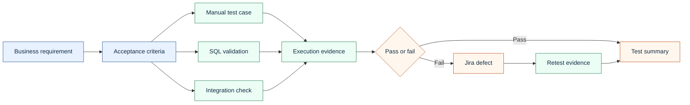

# Requirements Traceability Matrix

Traceability connects business requirements to test cases, SQL checks, integration checks, execution evidence, and defects. It helps prevent missed coverage and gives the team a clean audit trail.

The working CSV version is here: [requirements-traceability-matrix.csv](../artifacts/traceability/requirements-traceability-matrix.csv)

## Traceability Flow

## Example Requirements

| Requirement ID | Requirement | Coverage approach |
|---|---|---|
| BR-001 | System shall accept a valid professional claim for an active member and active provider. | Front-end claim creation, SQL claim header and line validation, status check |
| BR-002 | System shall deny a claim when the member is inactive on the service date. | Negative front-end test, SQL eligibility join, denial reason check |
| BR-003 | System shall flag duplicate claim candidates before payment. | Duplicate claim test, SQL duplicate detection query |
| BR-004 | System shall return accurate claim status through SOAP claim status inquiry. | SOAP request/response validation, SQL status comparison |
| BR-005 | System shall produce remittance output for paid claims. | 835-style file review, SQL payment/remittance relationship |
| BR-006 | System shall mask or restrict sensitive member information based on role. | Front-end role-based display test, access control evidence |

## How This Would Be Used On The Job

1. Confirm every requirement has test coverage before execution begins.
2. Add missing test cases when a requirement has only partial coverage.
3. Track failed cases to a defect ID.
4. Update retest status when fixes are deployed.
5. Use the matrix to explain release risk to QA leadership and project stakeholders.
