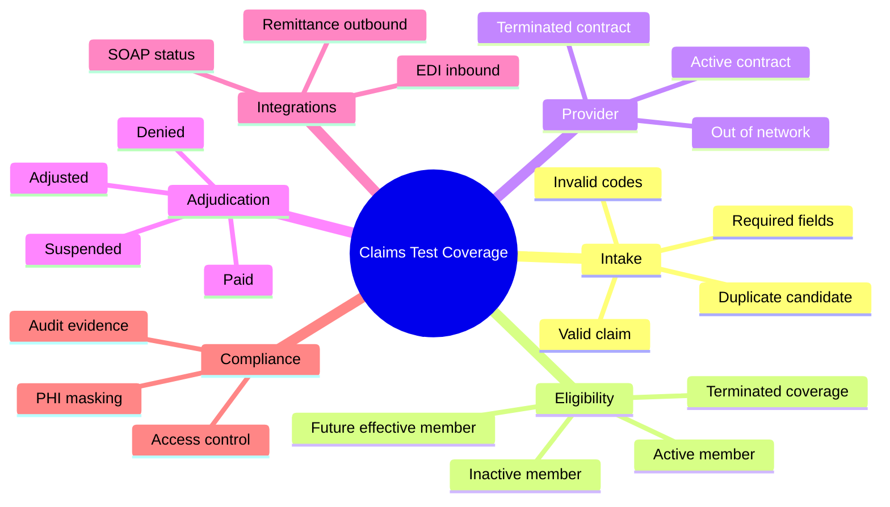

# Test Case Design

Good healthcare claims test cases should be specific enough to execute, but readable enough for business analysts, developers, and QA teammates to understand.

## Test Case Anatomy

| Field | Purpose |
|---|---|
| Test case ID | Stable reference used in traceability and execution |
| Requirement ID | Requirement being verified |
| Scenario | Short description of the behavior under test |
| Preconditions | Data, role, environment, and system state needed |
| Steps | Clear actions the tester performs |
| Expected result | Observable outcome that defines pass/fail |
| Backend validation | SQL or data check that confirms stored behavior |
| Evidence | Screenshot, query result, XML response, file output, or notes |
| Status | Pass, fail, blocked, not run |

## Coverage Heuristics

## Representative Test Cases

The complete executable list is here: [claims-test-cases.csv](../artifacts/test-cases/claims-test-cases.csv)

### TC-001: Clean Claim Pays

Purpose: Verify a valid professional claim for an active member and active in-network provider adjudicates to paid status.

Expected behavior:

- claim header status is Paid;
- claim line status is Paid;
- allowed amount and paid amount are calculated;
- remittance record is created;
- claim detail screen displays the same status and amounts stored in the database.

### TC-004: Inactive Member Denial

Purpose: Verify a claim denies when the member is inactive on the service date.

Expected behavior:

- claim status is Denied;
- denial reason is present;
- paid amount is zero;
- claim status inquiry returns Denied;
- front-end screen displays a clear denial reason without exposing unnecessary sensitive data.

### TC-007: Duplicate Claim Candidate

Purpose: Verify the system flags a potential duplicate before payment.

Expected behavior:

- duplicate flag is set;
- claim is suspended or routed for review based on business rule;
- no payment record is created before review;
- defect is logged if duplicate is paid automatically.

## Manual QA Notes

The strongest manual tests combine what the user sees with what the system stores. If the UI says Paid but the database has Denied, the defect is not cosmetic. It is a data integrity and operational risk.

