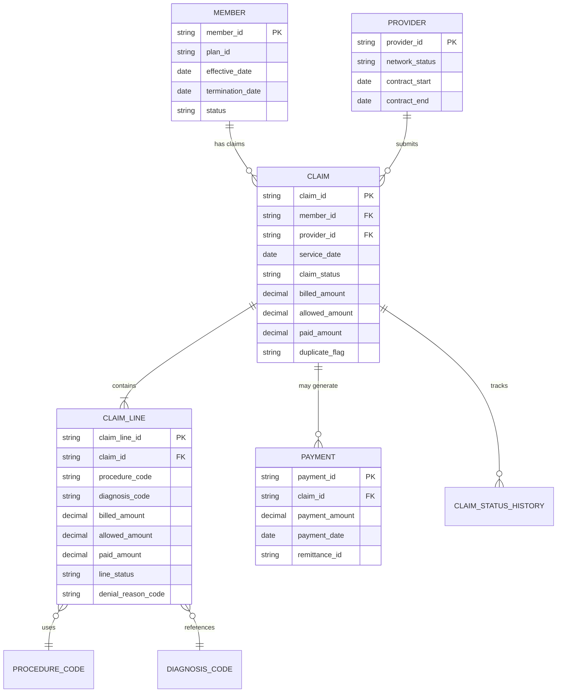
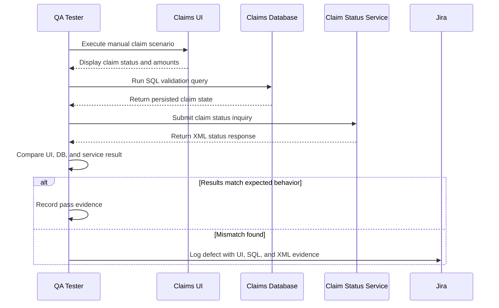

# SQL Backend Testing Guide

Backend testing verifies that the database state supports the front-end and integration behavior. In healthcare claims, the database is often the best source for finding hidden defects: orphan records, mismatched statuses, incorrect amounts, missing denial codes, and duplicate payments.

The SQL script is here: [claims_backend_validation.sql](../artifacts/sql/claims_backend_validation.sql)

## Synthetic Data Model

## Backend Checks To Run

| Check | Defect it can reveal |
|---|---|
| Claim header status differs from line status | UI/service may report the wrong status |
| Paid claim has no payment record | Financial output is incomplete |
| Denied claim has no denial reason | Business users cannot explain outcome |
| Paid amount exceeds allowed amount | Payment calculation defect |
| Claim service date outside member eligibility | Eligibility rule defect |
| Provider contract inactive on service date | Provider validation defect |
| Duplicate claim candidate paid automatically | Duplicate payment risk |
| Orphan claim line without claim header | Data integrity defect |

## SQL Testing Workflow

## Evidence Standard

When a SQL check supports a test result, the evidence should record:

- query name;
- environment;
- claim ID or synthetic data key;
- execution timestamp;
- expected row count or expected value;
- actual row count or actual value;
- pass/fail conclusion;
- defect ID if failed.
