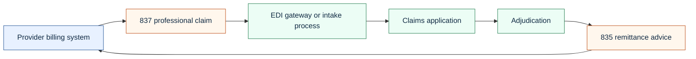
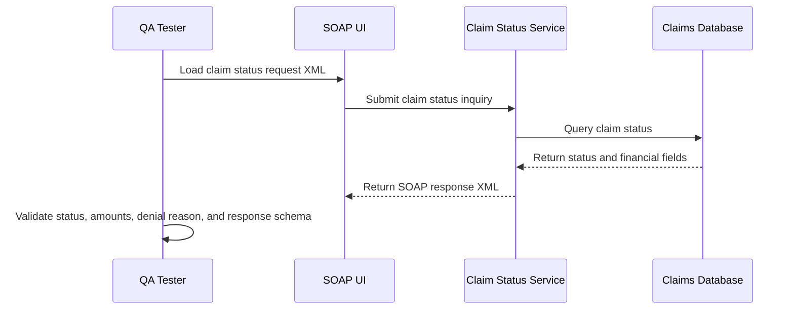

# EDI And SOAP/XML Testing Guide

Healthcare claims QA often requires enough integration understanding to validate whether the application is receiving, storing, transforming, and returning the right information.

This project uses simplified, synthetic examples. The goal is not to reproduce a complete payer-grade EDI implementation. The goal is to show the QA approach.

## EDI Flow

## EDI Checks

| File | QA focus |
|---|---|
| 837 claim | Claim ID, member ID, provider ID, service date, diagnosis, procedure, billed amount |
| 835 remittance | Claim ID, payment amount, adjustment reason, denial reason, remittance ID |
| 270/271 eligibility | Member eligibility status for service date |
| 276/277 claim status | Claim status inquiry and response consistency |

Sample files:

- [837P synthetic claim](../artifacts/edi/837P-synthetic-claim.edi)
- [835 synthetic remittance](../artifacts/edi/835-synthetic-remittance.edi)

## SOAP Claim Status Flow

Sample XML files:

- [Claim status request](../artifacts/soap/claim-status-request.xml)
- [Claim status response](../artifacts/soap/claim-status-response.xml)

## SOAP UI Test Ideas

| Test | Expected result |
|---|---|
| Valid claim ID returns current status | HTTP 200 and matching status payload |
| Unknown claim ID returns controlled error | No stack trace or sensitive data leak |
| Claim ID belongs to restricted plan | Response follows authorization rules |
| Paid claim includes allowed and paid amounts | Amounts match database |
| Denied claim includes denial reason | Denial code and message match database |
| Malformed XML request | Controlled validation error |

## What To Compare

For a claim status inquiry, compare:

- front-end claim detail status;
- database claim header status;
- latest status history row;
- SOAP response status;
- denial or adjustment reason;
- allowed and paid amounts;
- response timestamp and correlation ID.
