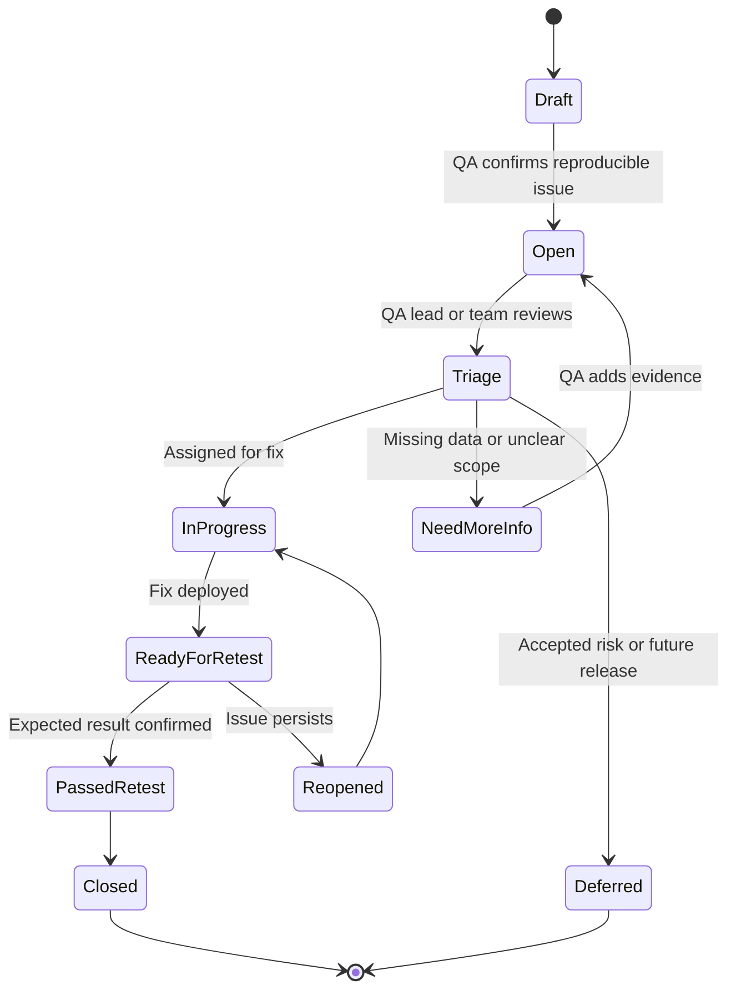

# Jira Defect Workflow

Defect quality matters because a vague bug creates delays. A strong defect lets a developer reproduce the issue, lets a business analyst understand the impact, and lets QA retest the fix without guessing.

## Defect Lifecycle

## Defect Template

| Field | Guidance |
|---|---|
| Summary | Clear one-line description of failed behavior |
| Environment | QA, integration, build number, browser if applicable |
| Requirement | Requirement ID or user story |
| Severity | Business impact |
| Priority | Fix urgency |
| Preconditions | Data, role, claim ID, member ID, provider ID |
| Steps to reproduce | Numbered, repeatable, no hidden assumptions |
| Expected result | What should happen |
| Actual result | What happened |
| Evidence | Screenshots, SQL results, XML, logs, file output |
| Impact | Financial, operational, compliance, or user impact |
| Retest criteria | Specific conditions required to close |

## Defect Quality Checklist

- Can another tester reproduce the issue from the ticket alone?
- Does the defect identify the exact claim or synthetic data key?
- Is expected behavior tied to a requirement?
- Is business impact clear?
- Is evidence attached or referenced?
- Does the ticket avoid exposing PHI?
- Is severity based on impact, not frustration?
- Are retest steps clear?

Sample writeups are here: [jira-defect-samples.md](../artifacts/defects/jira-defect-samples.md)

