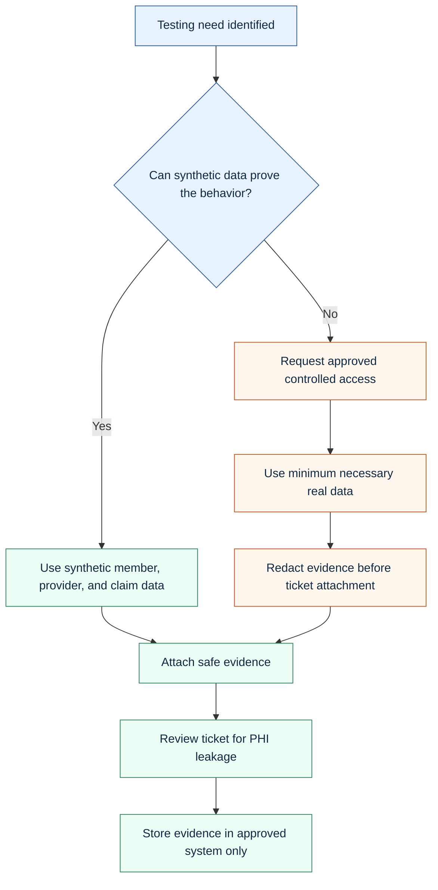

# HIPAA And PHI Test Data Strategy

This role is marked high risk because it may expose the tester to PHI-sensitive data. That changes how testing should be planned, executed, documented, and shared.

## Core Principle

Use the minimum necessary data for the testing purpose. Prefer synthetic data. Do not move PHI into screenshots, documents, chat, tickets, or public repositories.

## Data Handling Model

## Public Portfolio Rules Used Here

- No real names.
- No real member IDs.
- No real claim IDs.
- No real provider data.
- No real diagnosis tied to a real person.
- No employer-confidential workflows.
- No screenshots from real systems.
- No protected production data.

## On-The-Job Evidence Rules

| Evidence type | Safe handling |
|---|---|
| Screenshot | Use synthetic data or redact PHI before attaching |
| SQL result | Limit columns to what proves the result |
| Logs | Remove tokens, credentials, identifiers, and PHI |
| XML request/response | Use synthetic identifiers or mask restricted fields |
| Jira defect | Include enough detail to reproduce without unnecessary exposure |
| Test summary | Aggregate results, not patient-level details |

## HIPAA-Aware QA Behaviors

- Validate role-based access and masking.
- Avoid downloading data unless required and approved.
- Do not store PHI locally.
- Do not paste PHI into external tools.
- Confirm test accounts have appropriate role permissions.
- Keep evidence in approved systems.
- Use synthetic data for reusable regression scenarios.

