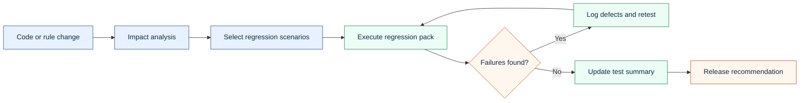

# Regression, Integration, And Load Testing Plan

## Regression Strategy

Regression testing protects existing claims behavior after a fix or release. The regression pack should focus on high-volume, high-risk, and previously defective workflows.

## Regression Pack

| Area | Regression scenarios |
|---|---|
| Intake | Valid claim, missing required field, invalid code |
| Eligibility | Active member, inactive member, future effective member |
| Provider | Active contract, inactive contract, out-of-network provider |
| Adjudication | Paid, denied, suspended, adjusted |
| Payment | Paid amount calculation, payment record creation, no overpayment |
| Remittance | Paid claim appears on remittance, denied claim includes adjustment reason |
| Claim status | UI, database, and SOAP response match |
| Security | PHI masking, role-based claim detail access |

## Integration Testing

Integration testing checks whether data moves correctly across systems and formats.

| Integration point | What to test |
|---|---|
| 837 to claim intake | Claim identifiers, service lines, member, provider, amount, diagnosis, procedure |
| Claims database to UI | Status, amounts, denial reasons, dates |
| Claims database to SOAP service | Claim status response fields match persisted data |
| Adjudication to 835 remittance | Paid and denied outcomes appear correctly |
| Claim status history | Latest status is reflected consistently across UI and service |

## Load Testing Plan

The job posting mentions load testing knowledge. For a manual QA role, the practical contribution is often the plan, data, scenario design, and result interpretation rather than full performance engineering ownership.

### Load Scenarios

| Scenario | Goal |
|---|---|
| Claim status inquiry volume | Confirm service can handle repeated status checks |
| Claim search usage | Confirm UI search remains usable under expected load |
| Batch claim intake | Confirm EDI-style processing meets throughput expectations |
| Payment/remittance generation | Confirm downstream processing completes within expected window |

### Performance Risks

- slow claim search;
- timeouts during high-volume status inquiry;
- delayed adjudication batch completion;
- database locks during claim update;
- remittance file generation delays;
- inconsistent status during asynchronous processing.

### Metrics To Watch

- response time;
- throughput;
- error rate;
- database CPU and lock waits;
- queue depth;
- batch completion time;
- timeout count;
- failed transaction count.
