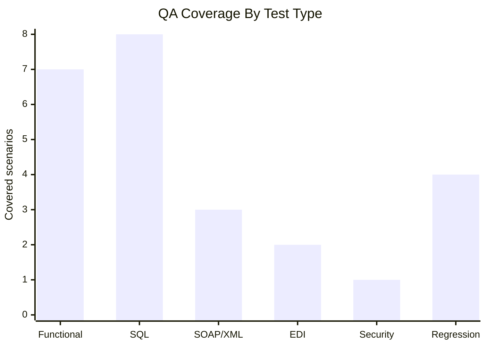
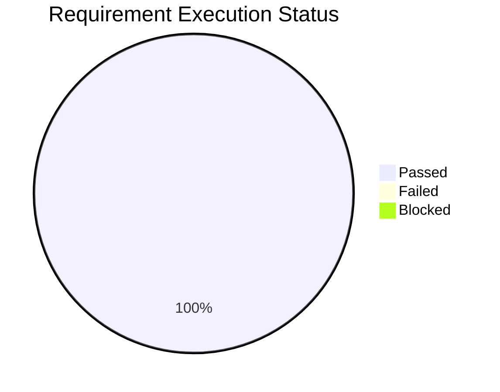

# Test Execution Summary

This summary models how QA execution status can be communicated to a project team after running the portfolio regression pack.

Working CSV: [test-execution-summary.csv](../artifacts/test-results/test-execution-summary.csv)

## Executive Summary

| Metric | Result |
|---|---:|
| Test cases executed | 13 |
| Passed | 13 |
| Failed | 0 |
| Blocked | 0 |
| Critical defects open | 0 |
| High defects open | 0 |
| Release recommendation | Proceed for synthetic portfolio scenario |

## Coverage Summary

## Requirement Status

## Release Recommendation

For the synthetic portfolio scenario, the release recommendation is proceed because all high-priority requirements have traceable passing evidence and no open critical or high defects remain.

In a production project, this recommendation would also depend on environment stability, known defect review, business signoff, deployment readiness, rollback planning, and final data privacy review.

## Residual Risk

| Risk | Treatment |
|---|---|
| Portfolio uses synthetic data instead of a real claims platform | Clearly documented as proof of QA approach, not production certification |
| Load testing is planned but not executed | Load scenarios and metrics are documented for performance engineering handoff |
| EDI examples are simplified | Used to demonstrate QA understanding of data flow and validation points |
