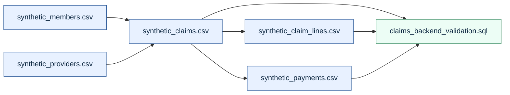

# Synthetic Data Dictionary

This project uses synthetic data to model healthcare claims QA behavior without exposing PHI.

## Data Relationship Overview

## Files

| File | Purpose |
|---|---|
| [synthetic_members.csv](../artifacts/data/synthetic_members.csv) | Member eligibility scenarios |
| [synthetic_providers.csv](../artifacts/data/synthetic_providers.csv) | Provider contract and network scenarios |
| [synthetic_claims.csv](../artifacts/data/synthetic_claims.csv) | Claim header scenarios |
| [synthetic_claim_lines.csv](../artifacts/data/synthetic_claim_lines.csv) | Claim line status, diagnosis, procedure, and amount scenarios |
| [synthetic_payments.csv](../artifacts/data/synthetic_payments.csv) | Payment and remittance scenarios |

## Scenario Keys

| Claim ID | Scenario | Expected status |
|---|---|---|
| CLM-5001 | Clean in-network professional claim | Paid |
| CLM-5002 | Inactive member denial | Denied |
| CLM-5003 | Duplicate claim candidate | Suspended |
| CLM-5004 | Inactive provider contract denial | Denied |
| CLM-5005 | Adjusted allowed amount scenario | Adjusted |

## Data Safety

All values are invented for portfolio use. The data set contains no patient names, no real member IDs, no real claim identifiers, no real provider identifiers, and no production data.

