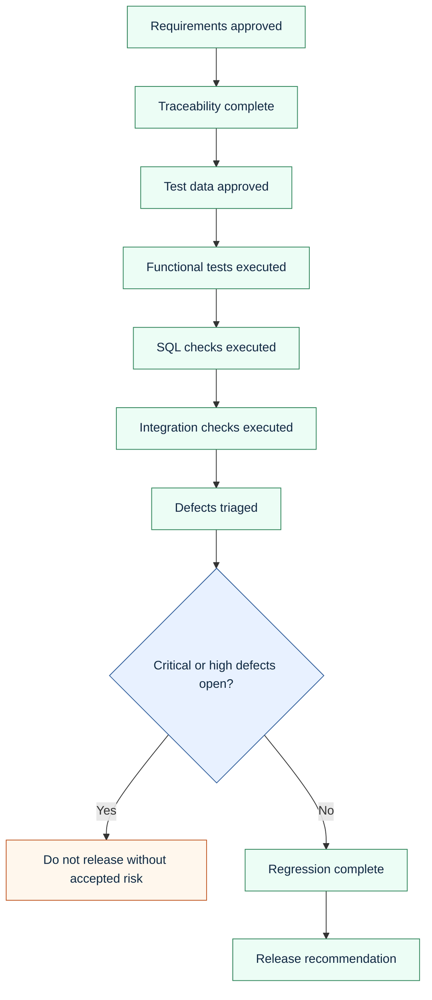

# Quality Gates

Quality gates define what must be true before this portfolio or a real QA package is considered ready.

## Portfolio Gates

| Gate | Status |
|---|---|
| README explains the target role and value clearly | Complete |
| Mermaid diagrams render as Markdown code blocks | Complete |
| Test cases map to requirements | Complete |
| SQL checks map to backend risks | Complete |
| SOAP XML parses successfully | Complete |
| CSV artifacts import successfully | Complete |
| Markdown links resolve locally | Complete |
| Public files contain synthetic data only | Complete |
| GitHub Actions smoke check exists | Complete |

## Real Project Gates

## Smoke Check

The repository includes [tools/smoke_check.py](../tools/smoke_check.py), which validates:

- required files exist;
- CSV artifacts contain expected rows;
- SOAP XML files parse;
- Markdown code fences are balanced;
- local Markdown links resolve;
- the repository includes substantial Mermaid coverage.

